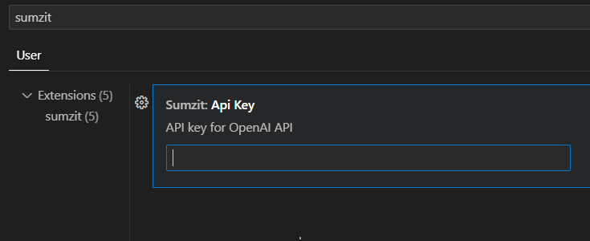
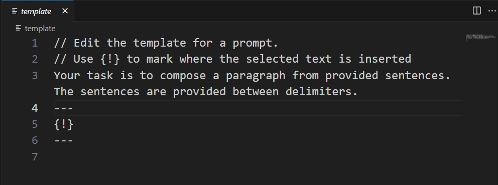

# sumzit - AI Assisted Authoring Tool

## Feature

This extension allows you to complete a selected region in a text editor using [OpenAI Text completion API](https://platform.openai.com/docs/guides/completion) and use the completion result in a few different ways.

1. Replace the selected region with the completion
2. Insert the completion where the cursor is
3. Open a new document with the completion
4. Write the completion to the dedicated output window.

You can customize the prompt for OpenAI chat completion to articulate the task with a selected region, giving you more control over the output.

## How to Use Completion

First, you need to configure your API key for OpenAI API in the settings. You can get one [here](https://platform.openai.com/).

Then, edit the prompt template to use for completion by invoking ``sumzit:Edit prompt template``. It will open up a text editor to edit the prompt template. ``{!}`` will be replaced with your selection. Once you done with editing, save it.

To use completion, invoke one of the following commands.

* ``sumzit: Replace selection with completion``
* ``sumzit: Insert completion before cursor``
* ``sumzit: Insert completion after cursor``
* ``sumzit: Write completion to output window``
* ``sumzit: Write completion to a new document``

NOTE: If you do not select a region, it's considered that the entire file is selected. 

## Settings

* `sumzit.template`: The prompt template. Use ``sumzit:Edit prompt template`` to edit it.
* `sumzit.model`: Specify the language model to use.
* `sumzit.apiKey`: Specify your API key.
* `sumzit.maxTokens`: Specify maximum tokens to use.
* `sumzit.temperature`: Specify temperature value (0.0 - 1.0).

## Known Issues
Completion can take some time, especially when the prompt is complicated. This asynchronicity can lead to confusion, especially when using the `sumzit:Replace selection with completion` command. This command will try to replace the original selection, which can be confusing if you have selected a different region before the replacement occurs.

## Release Notes

### 1.0.0
Initial release of sumzit.
